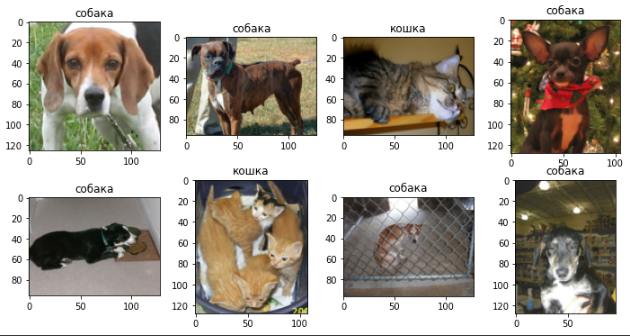
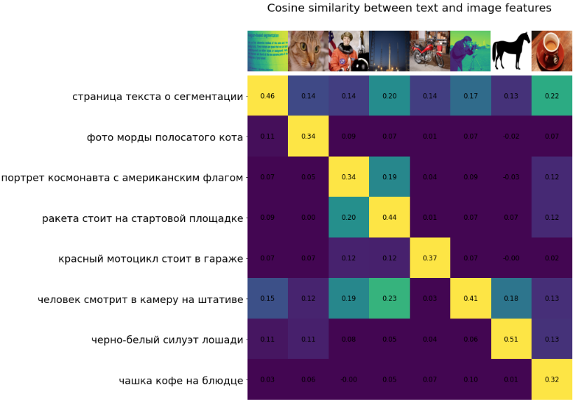
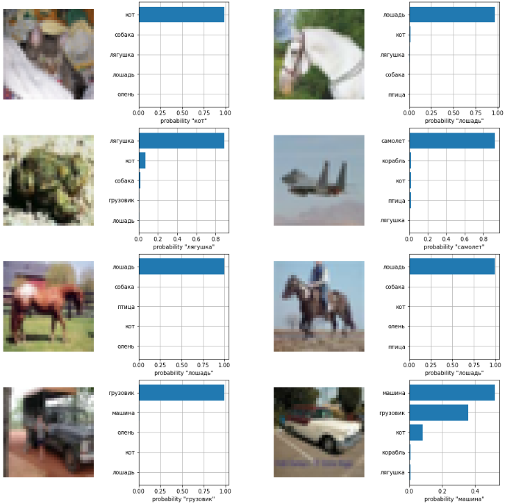

# RuCLIP

Zero-shot image classification model for Russian language

---

**RuCLIP** (**Ru**ssian **C**ontrastive **L**anguage–**I**mage **P**retraining) is a multimodal model 
for obtaining images and text similarities and rearranging captions and pictures. 
RuCLIP builds on a large body of work on zero-shot transfer, computer vision, natural language processing and 
multimodal learning. This repo has the prototypes model of OpenAI CLIP's Russian version following [this paper](https://arxiv.org/abs/2103.00020).


# Models

+ [ruclip-vit-base-patch32-224](https://huggingface.co/sberbank-ai/ruclip-vit-base-patch32-224) 🤗
+ [ruclip-vit-base-patch16-224](https://huggingface.co/sberbank-ai/ruclip-vit-base-patch16-224) 🤗
+ [ruclip-vit-large-patch14-224](https://huggingface.co/sberbank-ai/ruclip-vit-large-patch14-224) 🤗
+ [ruclip-vit-base-patch32-384](https://huggingface.co/sberbank-ai/ruclip-vit-base-patch32-384) 🤗
+ ruclip-vit-large-patch14-336  ☁️[SberCloud only](https://sbercloud.ru/ru/ai-services)
+ ruclip-vit-base-patch16-384 ☁️[SberCloud only](https://sbercloud.ru/ru/ai-services) ️


# Installing
```
pip install ruclip==0.0.1
```

# Usage 

[]()

### Init models
```python
import ruclip

device = 'cuda'
clip, processor = ruclip.load('ruclip-vit-large-patch14-224', device=device)
```

### Zero-Shot Classification [Minimal Example]
```python
import torch
import base64
import requests
from PIL import Image
from io import BytesIO

# prepare images
bs4_urls = requests.get('https://raw.githubusercontent.com/sberbank-ai/ru-dolph/master/pics/pipelines/cats_vs_dogs_bs4.json').json()
images = [Image.open(BytesIO(base64.b64decode(bs4_url))) for bs4_url in bs4_urls]

# prepare classes
classes = ['кошка', 'собака']
templates = ['{}', 'это {}', 'на картинке {}', 'это {}, домашнее животное']

# predict
predictor = ruclip.Predictor(clip, processor, device, bs=8, templates=templates)
with torch.no_grad():
    text_latents = predictor.get_text_latents(classes)
    pred_labels = predictor.run(images, text_latents)

# show results
f, ax = plt.subplots(2,4, figsize=(12,6))
for i, (pil_img, pred_label) in enumerate(zip(images, pred_labels)):
    ax[i//4, i%4].imshow(pil_img)
    ax[i//4, i%4].set_title(classes[pred_label])
```


### Cosine similarity Visualization Example




### Softmax Scores Visualization Example



# Performance

We have evaluated the performance zero-shot image classification on the following datasets:

| Dataset                       | ruclip-vit-base-patch32-224 | ruclip-vit-base-patch16-224 | ruclip-vit-large-patch14-224 | ruclip-vit-base-patch32-384 | ruclip-vit-large-patch14-336 ☁️[SberCloud only](https://sbercloud.ru/ru/ai-services) | ruclip-vit-base-patch16-384 ☁️[SberCloud only](https://sbercloud.ru/ru/ai-services) |
|:------------------------------|:----------------------------|:----------------------------|:-----------------------------|:----------------------------|:-------------------------------------------------------------------------------------|-------------------------------------------------------------------------------------|
| Food101, acc                  | 0.505                       | 0.552                       | 0.597       	                | 0.642                       | ***0.712*** 💥 	                                                                     | 0.689	                                                                              |
| CIFAR10, acc                  | 0.818                       | 0.810                       | 0.878                        | 0.862                       | **0.906** 💥                                                                         | 0.845                                                                               |
| CIFAR100, acc                 | 0.504                       | 0.496                       | 0.511                        | 0.529                       | **0.591** 💥                                                                         | 0.569                                                                               |
| Birdsnap, acc                 | 0.115                       | 0.117                       | 0.172                        | 0.161                       | **0.213** 💥                                                                         | 0.195                                                                               |
| SUN397, acc                   | 0.452                       | 0.462                       | 0.484                        | 0.510                       | **0.523** 💥                                                                         | 0.521                                                                               |
| Stanford Cars, acc            | 0.433                       | 0.487                       | 0.559                        | 0.572                       | **0.659** 💥                                                                         | 0.626                                                                               |
| DTD, acc                      | 0.380                       | 0.401                       | 0.370                        | 0.390                       | 0.408	                                                                               | **0.421** 💥 	                                                                      |
| MNIST, acc                    | 0.447                       | 0.464                       | 0.337                        | 0.404                       | 0.242	                                                                               | **0.478** 💥                                                                        |
| STL10, acc                    | 0.932                       | 0.932                       | 0.934                        | 0.946                       | 0.956	                                                                               | **0.964** 💥                                                                        |
| PCam, acc                     | 0.501                       | 0.505                       | 0.520                        | 0.506                       | **0.554** 💥                                                                         | 0.501                                                                               |
| CLEVR, acc                    | 0.148                       | 0.128                       | 0.152                        | **0.188** 💥                | 0.142                                                                                | 0.132                                                                               |
| Rendered SST2, acc            | 0.489                       | 0.527                       | 0.529                        | 0.508                       | **0.539** 💥                                                                         | 0.525                                                                               |
| ImageNet, acc                 | 0.375                       | 0.401                       | 0.426                        | 0.451                       | **0.488** 💥                                                                         | 0.482                                                                               |
| FGVC Aircraft, mean-per-class | 0.033                       | 0.043                       | 0.046                        | 0.053                       | **0.075** 💥                                                                         | 0.046                                                                               |
| Oxford Pets, mean-per-class   | 0.560                       | 0.595                       | 0.604                        | 0.587                       | 0.546                                                                                | **0.635** 💥                                                                        |
| Caltech101, mean-per-class    | 0.786                       | 0.775                       | 0.777                        | 0.834                       | **0.835** 💥                                                                         | **0.835** 💥                                                                        |
| Flowers102, mean-per-class    | 0.401                       | 0.388                       | 0.455                        | 0.449                       | **0.517** 💥                                                                         | 0.452                                                                               |
| Hateful Memes, roc-auc        | **0.564** 💥                 | 0.516                       | 0.530                        | 0.537                       | 0.519                                                                                | 0.543	                                                                              |


# Authors

+ Alex Shonenkov: [Github](https://github.com/shonenkov), [Kaggle GM](https://www.kaggle.com/shonenkov)
+ Daniil Chesakov: [Github](https://github.com/Danyache)
+ Denis Dimitrov: [Github](https://github.com/denndimitrov)
+ Igor Pavlov: [Github](https://github.com/boomb0om)


# Supported by

[](https://github.com/sberbank-ai) \
[](https://sberdevices.ru)

[](https://sbercloud.ru/) \
[](https://airi.net)
