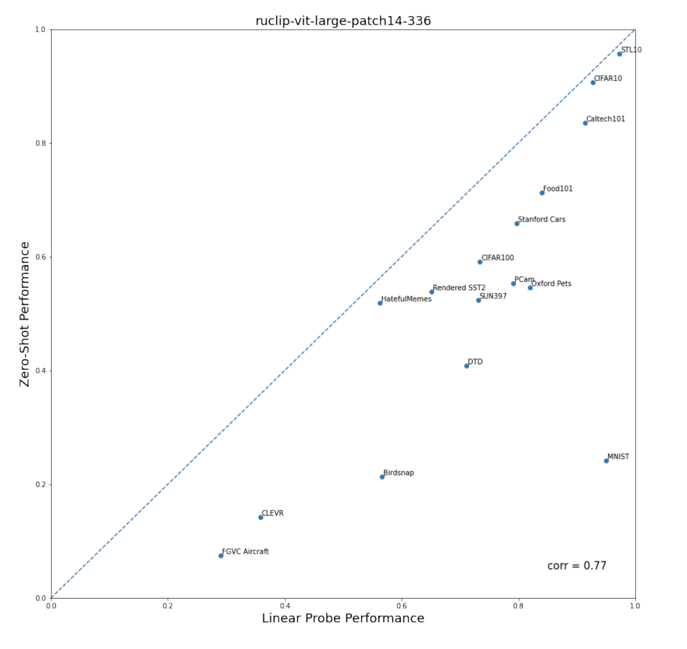

# RuCLIP

Zero-shot image classification model for Russian language

---

**RuCLIP** (**Ru**ssian **C**ontrastive **L**anguage–**I**mage **P**retraining) is a multimodal model
for obtaining images and text similarities and rearranging captions and pictures.
RuCLIP builds on a large body of work on zero-shot transfer, computer vision, natural language processing and
multimodal learning. This repo has the prototypes model of OpenAI CLIP's Russian version following [this paper](https://arxiv.org/abs/2103.00020).

# Models

+ [ruclip-vit-base-patch32-224](https://huggingface.co/sberbank-ai/ruclip-vit-base-patch32-224) 🤗
+ [ruclip-vit-base-patch16-224](https://huggingface.co/sberbank-ai/ruclip-vit-base-patch16-224) 🤗
+ [ruclip-vit-large-patch14-224](https://huggingface.co/sberbank-ai/ruclip-vit-large-patch14-224) 🤗
+ [ruclip-vit-base-patch32-384](https://huggingface.co/sberbank-ai/ruclip-vit-base-patch32-384) 🤗
+ [ruclip-vit-large-patch14-336](https://huggingface.co/sberbank-ai/ruclip-vit-large-patch14-336) 🤗
+ [ruclip-vit-base-patch16-384](https://huggingface.co/sberbank-ai/ruclip-vit-base-patch16-384) 🤗

# Installing

```
pip install ruclip==0.0.2
```

# Usage

[](https://colab.research.google.com/drive/1vXu3s0rcAOEAciz7B3vmVHd4J_gUJnk9?usp=sharing)
Standart RuCLIP API

[](https://colab.research.google.com/drive/1hgu7GNfBriLmAHg1oskdNIQsc0WJMwDa?usp=sharing)
RuCLIP + SberVqgan

[](https://colab.research.google.com/github/Lednik7/CLIP-ONNX/blob/main/examples/RuCLIP_onnx_example.ipynb)
ONNX example

### Init models

```python
import ruclip

device = 'cuda'
clip, processor = ruclip.load('ruclip-vit-base-patch32-384', device=device)
```

### Zero-Shot Classification [Minimal Example]

```python
import torch
import base64
import requests
import matplotlib.pyplot as plt
from PIL import Image
from io import BytesIO

# prepare images
bs4_urls = requests.get('https://raw.githubusercontent.com/sberbank-ai/ru-dolph/master/pics/pipelines/cats_vs_dogs_bs4.json').json()
images = [Image.open(BytesIO(base64.b64decode(bs4_url))) for bs4_url in bs4_urls]

# prepare classes
classes = ['кошка', 'собака']
templates = ['{}', 'это {}', 'на картинке {}', 'это {}, домашнее животное']

# predict
predictor = ruclip.Predictor(clip, processor, device, bs=8, templates=templates)
with torch.no_grad():
    text_latents = predictor.get_text_latents(classes)
    pred_labels = predictor.run(images, text_latents)

# show results
f, ax = plt.subplots(2,4, figsize=(12,6))
for i, (pil_img, pred_label) in enumerate(zip(images, pred_labels)):
    ax[i//4, i%4].imshow(pil_img)
    ax[i//4, i%4].set_title(classes[pred_label])
```


### Cosine similarity Visualization Example


### Softmax Scores Visualization Example


### Linear Probe and ZeroShot Correlation Results



### Linear Probe Example

```python
train = CIFAR100(root, download=True, train=True)
test = CIFAR100(root, download=True, train=False)

with torch.no_grad():
    X_train = predictor.get_image_latents((pil_img for pil_img, _ in train)).cpu().numpy()
    X_test = predictor.get_image_latents((pil_img for pil_img, _ in test)).cpu().numpy()
    y_train, y_test = np.array(train.targets), np.array(test.targets)

clf = LogisticRegression(solver='lbfgs', penalty='l2', max_iter=1000, verbose=1)
clf.fit(X_train, y_train)
y_pred = clf.predict(X_test)
accuracy = np.mean((y_test == y_pred).astype(np.float)) * 100.
print(f"Accuracy = {accuracy:.3f}")
```

`>>> Accuracy = 75.680`

# Performance

We have evaluated the performance zero-shot image classification on the following datasets:


| Dataset                       | [ruCLIP Base \[vit-base-patch32-224\]](https://huggingface.co/sberbank-ai/ruclip-vit-base-patch32-224) | [ruCLIP Base \[vit-base-patch16-224\]](https://huggingface.co/sberbank-ai/ruclip-vit-base-patch16-224) | [ruCLIP Large \[vit-large-patch14-224\]](https://huggingface.co/sberbank-ai/ruclip-vit-large-patch14-224) | [ruCLIP Base \[vit-base-patch32-384\]](https://huggingface.co/sberbank-ai/ruclip-vit-base-patch32-384) | [ruCLIP Large \[vit-large-patch14-336\]](https://huggingface.co/sberbank-ai/ruclip-vit-large-patch14-336) | [ruCLIP Base \[vit-base-patch16-384\]](https://huggingface.co/sberbank-ai/ruclip-vit-base-patch16-384) | CLIP \[vit-base-patch16-224\] original + [OPUS-MT](https://huggingface.co/Helsinki-NLP/opus-mt-ru-en) | CLIP \[vit-base-patch16-224\] original |
| :----------------------------- | :------------------------------------------------------------------------------------------------------ | :------------------------------------------------------------------------------------------------------ | :--------------------------------------------------------------------------------------------------------- | :------------------------------------------------------------------------------------------------------ | :-------------------------------------------------------------------------------------------------------- | :------------------------------------------------------------------------------------------------------- | :----------------------------------------------------------------------------------------------------- | :-------------------------------------- |
| Food101, acc                  | 0.505                                                                                                  | 0.552                                                                                                  | 0.597                                                                                                     | 0.642                                                                                                  | **0.712**💥                                                                                                 | 0.689                                                                                                   | 0.664                                                                                                 | 0.883                                  |
| CIFAR10, acc                  | 0.818                                                                                                  | 0.810                                                                                                  | 0.878                                                                                                     | 0.862                                                                                                  | **0.906**💥                                                                                                 | 0.845                                                                                                   | 0.859                                                                                                 | 0.893                                  |
| CIFAR100, acc                 | 0.504                                                                                                  | 0.496                                                                                                  | 0.511                                                                                                     | 0.529                                                                                                  | 0.591                                                                                                    | 0.569                                                                                                   | **0.603**💥                                                                                               | 0.647                                  |
| Birdsnap, acc                 | 0.115                                                                                                  | 0.117                                                                                                  | 0.172                                                                                                     | 0.161                                                                                                  | **0.213**💥                                                                                                 | 0.195                                                                                                   | 0.126                                                                                                 | 0.396                                  |
| SUN397, acc                   | 0.452                                                                                                  | 0.462                                                                                                  | 0.484                                                                                                     | 0.510                                                                                                  | **0.523**💥                                                                                                 | 0.521                                                                                                   | 0.447                                                                                                 | 0.631                                  |
| Stanford Cars, acc            | 0.433                                                                                                  | 0.487                                                                                                  | 0.559                                                                                                     | 0.572                                                                                                  | **0.659**💥                                                                                                 | 0.626                                                                                                   | 0.567                                                                                                 | 0.638                                  |
| DTD, acc                      | 0.380                                                                                                  | 0.401                                                                                                  | 0.370                                                                                                     | 0.390                                                                                                  | 0.408                                                                                                    | **0.421**💥                                                                                                | 0.243                                                                                                 | 0.432                                  |
| MNIST, acc                    | 0.447                                                                                                  | 0.464                                                                                                  | 0.337                                                                                                     | 0.404                                                                                                  | 0.242                                                                                                    | 0.478                                                                                                   | **0.559**💥                                                                                              | 0.559                                  |
| STL10, acc                    | 0.932                                                                                                  | 0.932                                                                                                  | 0.934                                                                                                     | 0.946                                                                                                  | 0.956                                                                                                    | 0.964                                                                                                   | **0.967**💥                                                                                              | 0.970                                  |
| PCam, acc                     | 0.501                                                                                                  | 0.505                                                                                                  | 0.520                                                                                                     | 0.506                                                                                                  | 0.554                                                                                                    | 0.501                                                                                                   | **0.603**💥                                                                                              | 0.573                                  |
| CLEVR, acc                    | 0.148                                                                                                  | 0.128                                                                                                  | 0.152                                                                                                     | 0.188                                                                                                  | 0.142                                                                                                    | 0.132                                                                                                   | **0.240**💥                                                                                              | 0.240                                  |
| Rendered SST2, acc            | 0.489                                                                                                  | 0.527                                                                                                  | 0.529                                                                                                     | 0.508                                                                                                  | **0.539**💥                                                                                                 | 0.525                                                                                                   | 0.484                                                                                                 | 0.484                                  |
| ImageNet, acc                 | 0.375                                                                                                  | 0.401                                                                                                  | 0.426                                                                                                     | 0.451                                                                                                  | **0.488**💥                                                                                                 | 0.482                                                                                                   | 0.392                                                                                                 | 0.638                                  |
| FGVC Aircraft, mean-per-class | 0.033                                                                                                  | 0.043                                                                                                  | 0.046                                                                                                     | 0.053                                                                                                  | 0.075                                                                                                    | 0.046                                                                                                   | **0.220**💥                                                                                              | 0.244                                  |
| Oxford Pets, mean-per-class   | 0.560                                                                                                  | 0.595                                                                                                  | 0.604                                                                                                     | 0.587                                                                                                  | 0.546                                                                                                    | **0.635**💥                                                                                                | 0.507                                                                                                 | 0.874                                  |
| Caltech101, mean-per-class    | 0.786                                                                                                  | 0.775                                                                                                  | 0.777                                                                                                     | 0.834                                                                                                  | **0.835**💥                                                                                                 | **0.835**💥                                                                                                | 0.792                                                                                                 | 0.883                                  |
| Flowers102, mean-per-class    | 0.401                                                                                                  | 0.388                                                                                                  | 0.455                                                                                                     | 0.449                                                                                                  | **0.517**💥                                                                                                 | 0.452                                                                                                   | 0.357                                                                                                 | 0.697                                  |
| Hateful Memes, roc-auc        | 0.564                                                                                                  | 0.516                                                                                                  | 0.530                                                                                                     | 0.537                                                                                                  | 0.519                                                                                                    | 0.543                                                                                                   | **0.579**💥                                                                                              | 0.589                                  |

And for linear-prob evaluation:

| Dataset       | ruCLIP Base \[vit-base-patch32-224\] | ruCLIP Base \[vit-base-patch16-224\] | ruCLIP Large \[vit-large-patch14-224\] | ruCLIP Base \[vit-base-patch32-384\] | [ruCLIP Large \[vit-large-patch14-336\]](https://huggingface.co/sberbank-ai/ruclip-vit-large-patch14-336) | [ruCLIP Base \[vit-base-patch16-384\]](https://huggingface.co/sberbank-ai/ruclip-vit-base-patch16-384) | CLIP \[vit-base-patch16-224\] original |
| :------------- | :------------------------------------ | :------------------------------------ | :-------------------------------------- | :------------------------------------ | :------------------------------------------------ | :----------------------------------------------- | :-------------------------------------- |
| Food101       | 0.765                                | 0.827                                | 0.840                                  | 0.851                                | **0.896**💥                                         | 0.890                                           | 0.901                                  |
| CIFAR10       | 0.917                                | 0.922                                | 0.927                                  | 0.934                                | **0.943**💥                                         | 0.942                                           | 0.953                                  |
| CIFAR100      | 0.716                                | 0.739                                | 0.734                                  | 0.745                                | 0.770                                            | **0.773**💥                                        | 0.808                                  |
| Birdsnap      | 0.347                                | 0.503                                | 0.567                                  | 0.434                                | 0.609                                            | **0.612**💥                                        | 0.664                                  |
| SUN397        | 0.683                                | 0.721                                | 0.731                                  | 0.721                                | **0.759**💥                                         | 0.758                                           | 0.777                                  |
| Stanford Cars | 0.697                                | 0.776                                | 0.797                                  | 0.766                                | 0.831                                            | **0.840**💥                                        | 0.866                                  |
| DTD           | 0.690                                | 0.734                                | 0.711                                  | 0.703                                | 0.731                                            | **0.749**💥                                        | 0.770                                  |
| MNIST         | 0.963                                | **0.974**💥                             | 0.949                                  | 0.965                                | 0.949                                            | 0.971                                           | 0.989                                  |
| STL10         | 0.957                                | 0.962                                | 0.973                                  | 0.968                                | **0.981**💥                                         | 0.974                                           | 0.982                                  |
| PCam          | 0.827                                | 0.823                                | 0.791                                  | 0.835                                | 0.807                                            | **0.846**💥                                        | 0.830                                  |
| CLEVR         | 0.356                                | 0.360                                | 0.358                                  | 0.308                                | 0.318                                            | **0.378**💥                                        | 0.604                                  |
| Rendered SST2 | 0.603                                | 0.655                                | 0.651                                  | 0.651                                | 0.637                                            | **0.661**💥                                        | 0.606                                  |
| FGVC Aircraft | 0.254                                | 0.312                                | 0.290                                  | 0.283                                | 0.341                                            | **0.362**💥                                        | 0.604                                  |
| Oxford Pets   | 0.774                                | 0.820                                | 0.819                                  | 0.730                                | 0.753                                            | **0.856**💥                                        | 0.931                                  |
| Caltech101    | 0.904                                | 0.917                                | 0.914                                  | 0.922                                | **0.937**💥                                         | 0.932                                           | 0.956                                  |
| HatefulMemes  | 0.545                                | 0.568                                | 0.563                                  | 0.581                                | **0.585**💥                                         | 0.578                                           | 0.645                                  |

Also, we have created speed comparison based on CIFAR100 dataset using Nvidia-V100 for evaluation:

|          | ruclip-vit-base-patch32-224 | ruclip-vit-base-patch16-224 | ruclip-vit-large-patch14-224 | ruclip-vit-base-patch32-384 | ruclip-vit-large-patch14-336 | ruclip-vit-base-patch16-384 |
|----------|-----------------------------|-----------------------------|------------------------------|-----------------------------|------------------------------|-----------------------------|
| iter/sec | **308.84** 💥                  | 155.35                      | 49.95                        | 147.26                      | 22.11                        | 61.79                       |

# Authors

+ Alex Shonenkov: [Github](https://github.com/shonenkov), [Kaggle GM](https://www.kaggle.com/shonenkov)
+ Daniil Chesakov: [Github](https://github.com/Danyache)
+ Denis Dimitrov: [Github](https://github.com/denndimitrov)
+ Igor Pavlov: [Github](https://github.com/boomb0om)
+ Andrey Kuznetsov: [Github](https://github.com/kuznetsoffandrey)
+ Anastasia Maltseva: [Github](https://github.com/NastyaMittseva)

# Supported by

[](https://airi.net)

### Social Media

[](https://habr.com/ru/company/sberbank/blog/646447/)
